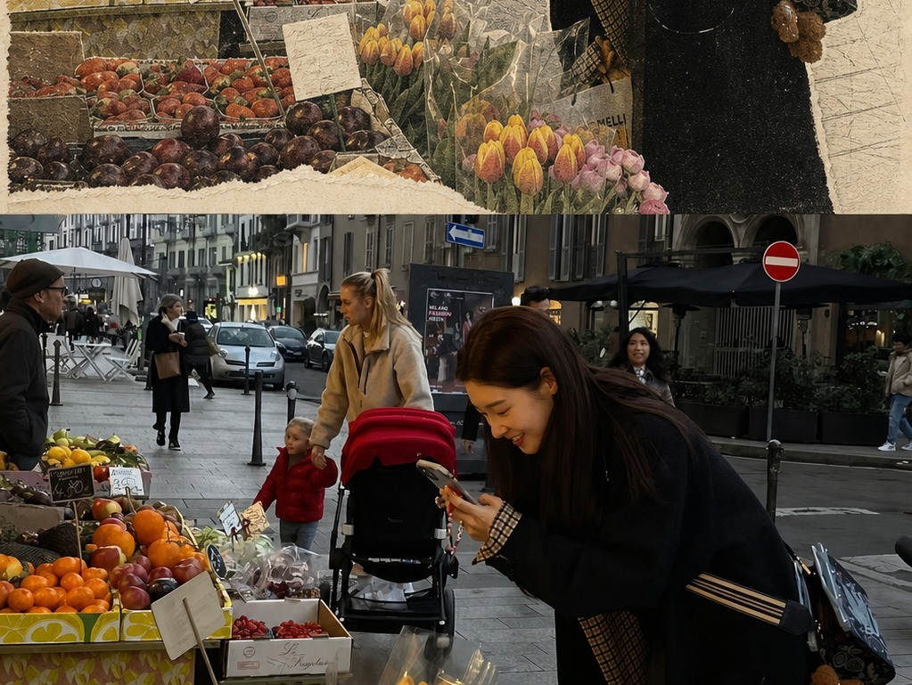
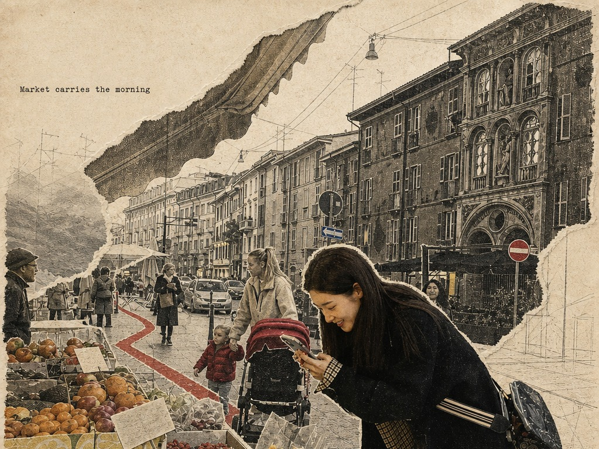
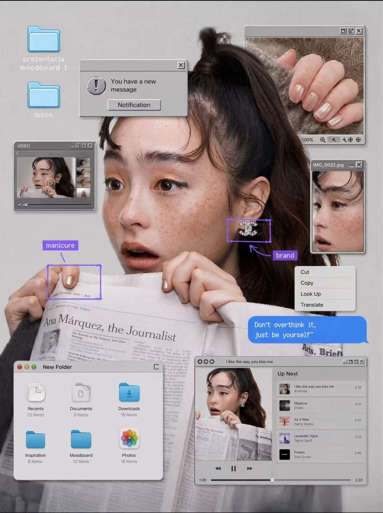
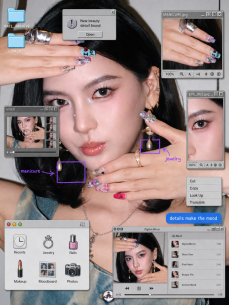
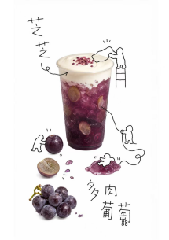
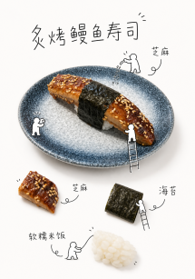

# Visual Language Template Extractor

一个面向 Codex 的视觉语言提取 Skill：从用户提供的图片或视频参考中识别真实设计画布，提炼可执行的视觉 DNA，确认固定层、可替换层、编辑字段和遮挡关系，再生成可复用的静态或动态模板。

它的核心不是“照着参考图重新画一张图”，而是把参考素材拆成可执行的构图、字体、色彩、材质、UI、遮挡和动效规则，再把这些规则套用到用户自己的目标照片或视频上。参考图只负责视觉语言；复刻图中的人物身份、脸、五官和原始主体像素始终来自目标素材。

## 核心能力

- 排除截图、录屏和平台界面，只分析真实设计画布
- 提取画布比例、构图、照片插槽、字体、色彩、材质、图层和动效参数
- 使用“模板确认单”确认固定内容、上传区域、可编辑字段和输出规格
- 强制保护人物与目标照片的原始像素，避免整图重绘造成身份漂移
- 生成参考图/复刻图双栏对照的视觉灵感卡片
- 使用白色底板和自适应信息格，完整保留提炼原文与中文 Prompt

## 安装

将本仓库克隆到 Codex 的 skills 目录：

```bash
git clone https://github.com/psyche-ci/Visual-Language-Template-Extractor-skill.git ~/.codex/skills/visual-language-template-extractor
```

重新启动 Codex 后，可通过 `$visual-language-extractor` 调用。

## 使用流程

1. 上传喜欢的参考图片或视频。
2. 调用 `$visual-language-extractor` 提炼视觉语言。
3. 检查并确认“模板确认单”。
4. 上传目标照片，生成同款复刻图。
5. 确认复刻图后，生成最终视觉灵感卡片。

## 效果复刻案例

以下案例展示 Skill 的典型输出方向。每个案例的原图/复刻图都是一张完整图片；只有“不同案例”才左右排版，不把一张原图拆成上下两张。图片文件按用户提供的原始格式和像素保存，页面只用 `width` 控制显示大小，不重新导出、不降采样、不把 PNG 转成 JPEG。

### 撕纸拼贴与风景照片复刻

保留目标照片中的人物、山体和画面关系，只提取参考中的撕纸边缘、纸张底色、颗粒质感和标题排版。每个案例都用左原图、右复刻图对照，单张图内部不拆分。

<table>
<tr><th>原图</th><th>复刻图</th></tr>
<tr>
<td></td>
<td></td>
</tr>
</table>

### 市场照片的纸张拼贴复刻

将目标街市场景套用复古纸张、铅笔线稿、局部着色和手写标题语言；人物主体不以参考人物替换。左边是原图，右边是完整复刻图。

<table>
<tr><th>原图</th><th>复刻图</th></tr>
<tr>
<td></td>
<td></td>
</tr>
</table>

### 复古桌面窗口与人像 Moodboard：原图 / 复刻图

左边是视觉语言提取用的原图，右边是同一套窗口、弹窗、标注框、播放器和文件夹语言套用到目标照片后的复刻图。两张图都保持完整画布，不裁切、不拆分；复刻图人物五官只取自目标照片。

<table>
<tr><th>原图</th><th>复刻图</th></tr>
<tr>
<td></td>
<td></td>
</tr>
</table>

### 喜茶风产品视觉

这是喜茶风的产品视觉：以真实饮品和食物照片为主体，叠加手绘线条、拟人化小角色、手写字和留白构图；不把它归类为插画风，也不把照片重绘成插画。

<table>
<tr>
<td></td>
<td></td>
</tr>
</table>

## 文件结构

```text
visual-language-template-extractor/
├── SKILL.md
├── README.md
├── examples/
│   ├── case-01-weather-paper-collage-effect.jpg
│   ├── case-01-weather-paper-collage-original.jpg
│   ├── case-02-market-paper-collage-effect.jpg
│   ├── case-02-market-paper-collage-original.jpg
│   ├── case-03-retro-desktop-moodboard-hq.jpg
│   ├── case-04-beauty-desktop-moodboard.png
│   ├── case-05-heicha-grape-drink.png
│   └── case-06-heicha-sushi.png
└── agents/
    └── openai.yaml
```

## 重要约束

- 不把平台 UI、黑边或录制控件误认为设计元素。
- 不擅自改脸、换人、重绘人物、手部或目标主体。
- 复刻时目标图是人物身份、脸和五官的唯一来源；参考图不得作为脸部生成条件，禁止 face swap、FaceID/身份嵌入、整脸重绘和五官迁移。
- 生成后必须核对眼睛、眉形、鼻唇轮廓、脸型和发际线；任一身份漂移都判定失败并回退到原始像素锁定合成。
- 参考图与目标图必须分角色传入；没有目标图时只提炼视觉语言，不生成复刻图。
- 不在用户确认模板结构之前生成最终复刻。
- 不压缩已确认的视觉语言或可复用中文 Prompt。
